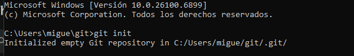
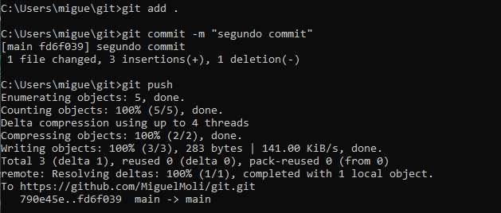
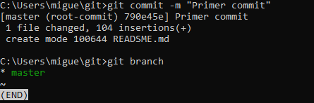
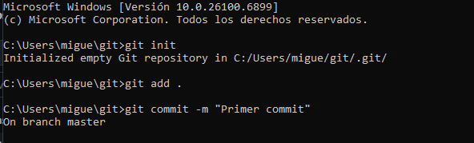
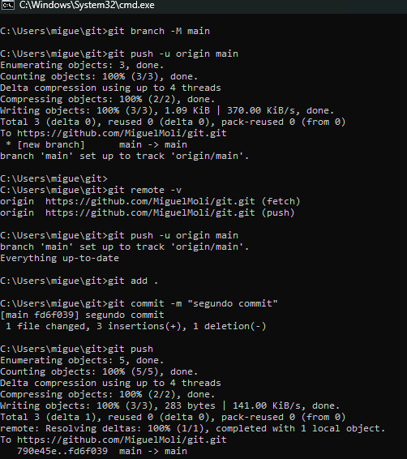

# Principales comandos de Git

En este cuaderno aprenderás los comandos básicos de **Git**, con explicaciones y ejemplos prácticos.

#  1. Inicializar un repositorio

Crea un nuevo repositorio Git en la carpeta actual.

git init

#  2. Clonar un repositorio

Descarga una copia de un repositorio remoto (por ejemplo, de GitHub).

git clone https://github.com/MiguelMoli/docker.git

#  3. Agregar archivos al área de preparación

Selecciona los archivos que deseas incluir en el próximo commit.

git add archivo.txt

# Para agregar todos los archivos modificados:

git add .

#  4. Ver el estado actual del repositorio

Muestra qué archivos han cambiado, están listos para commit o no están rastreados.

git status

#  5. Guardar los cambios en un commit

Registra los cambios con un mensaje descriptivo.

git commit -m "Agregué la sección de contacto al sitio web"

#  6. Ver el historial de commits
Muestra todos los commits realizados en el repositorio.

git log

#  7. Crear y listar ramas
Permite trabajar en versiones paralelas del proyecto.

git branch

git branch nueva-rama

#  8. Cambiar de rama
Cambia a una rama existente.

git checkout nueva-rama

#  9. Fusionar ramas
Combina los cambios de una rama con la actual.

git merge nueva-rama

#  10. Conectar con un repositorio remoto
Vincula el repositorio local con uno alojado en GitHub o GitLab.

git remote add origin https://github.com/usuario/nombre-repositorio.git

#  11. Subir los cambios al repositorio remoto
Envía tus commits al repositorio en GitHub.

git push -u origin main

#  12. Descargar los cambios del repositorio remoto
Actualiza tu repositorio local con los cambios más recientes.

git pull origin main

#  13. Ver diferencias entre archivos
Muestra las diferencias entre lo modificado y lo último guardado.

git diff

#  14. Eliminar archivos del repositorio
Borra un archivo tanto del área de trabajo como del repositorio.

git rm archivo.txt

# Esta es la evidencia de como lo hice

## init

## branch

## add

## push 

## commit

## 1

## 2

## 3

